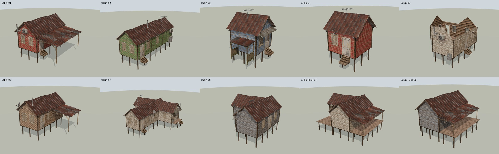
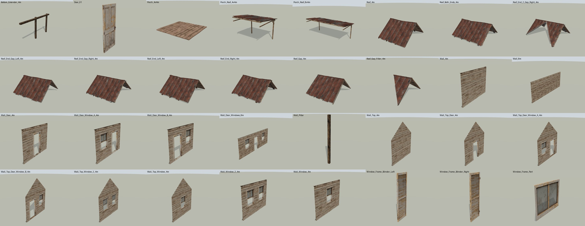
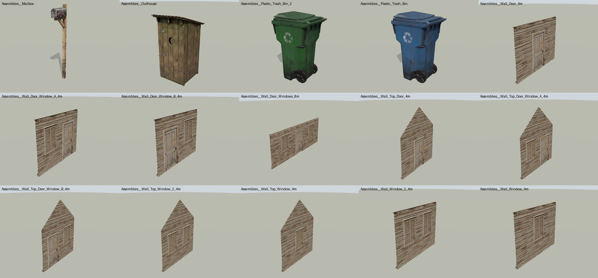
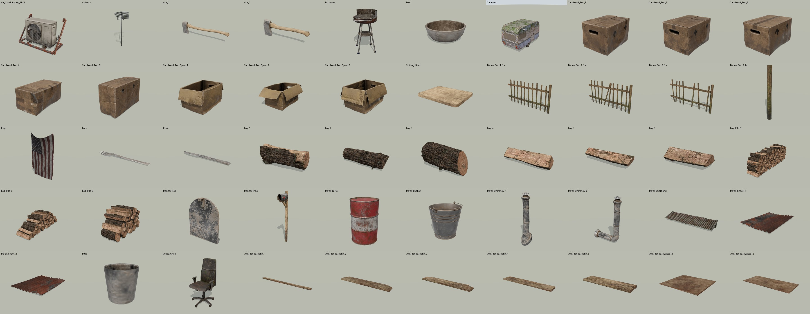
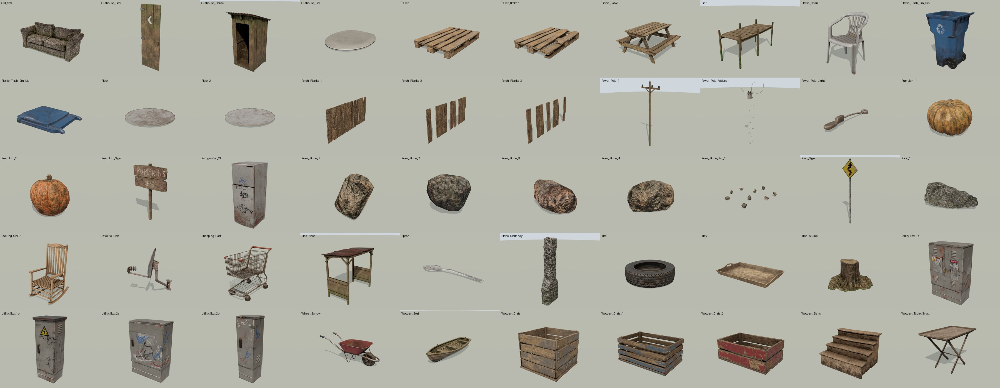
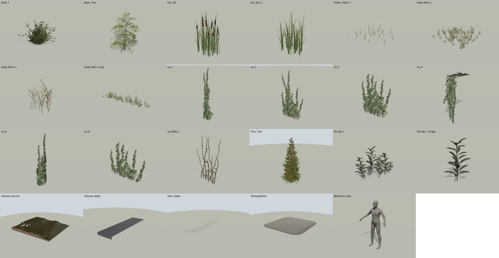
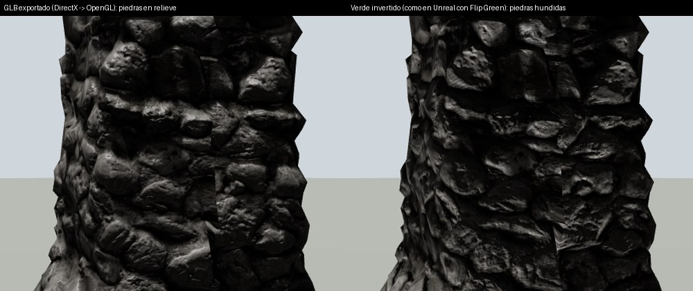

# Modular Rural Cabin → GLB por modelo

Conversión del proyecto de Unreal Engine 4.22 **Modular Rural Cabin** (`Modular_Rural_Cabin.zip`, 2.6 GB, uso privado) a **un GLB por modelo**, con texturas PBR incrustadas en alta calidad.

El zip no trae FBX: trae el contenido nativo de Unreal (595 archivos `.uasset`/`.umap`). Esos son 155 mallas, 273 texturas, 97 instancias de material sobre 8 materiales maestros, 32 Blueprints y 5 niveles. Todo se leyó directamente de los `.uasset`, sin Unreal Engine, con el lector incluido en [`scripts/`](scripts).



## Qué se entrega

| Carpeta | Contenido | Archivos |
|---|---|---|
| `glb/Modular/` | Piezas modulares: paredes de 4 y 8 m (lisas, con puerta, con ventanas), techos, porches, pilares, extensores, puerta | 32 |
| `glb/Props/` | Props: muebles, cajas, barriles, herramientas, caravana, muelle, bote, cobertizo, letrina, postes, etc. | 100 |
| `glb/Foliage/` | Vegetación: pino, abedul, arbustos, hiedras, pastos, totoras | 18 |
| `glb/Unique/` | Piezas del diorama de presentación: terreno, agua, cables, piso | 4 |
| `glb/Utility/` | Maniquí de referencia de escala | 1 |
| `glb/Assemblies/` | **Blueprints ensamblados**: cada pared con su puerta, marco y contraventanas; letrina con puerta y tapa; buzón; basureros | 15 |
| `glb/Cabins/` | **Cabañas completas** tal como las armó el autor en sus niveles: 8 de `Modular_Cabins_Showcase` y 2 de `Rural_Cabins` | 10 |

Total: **180 GLB, 7.27 GB**. El catálogo completo, con medidas, triángulos, materiales y peso de cada archivo, está en [`MODELOS.md`](MODELOS.md).

Los GLB no se versionan en este repositorio: suman 7.27 GB y las 10 cabañas superan el límite de 100 MB por archivo de GitHub. Su destino es la carpeta de Google Drive `Assets/Modular Rural Cabin GLB/`, con la misma estructura de subcarpetas. Aquí quedan el código que los genera, el catálogo, los informes y las vistas previas.

### Galería

| | |
|---|---|
| Piezas modulares  | Ensamblajes de Blueprint  |
| Props (1/2)  | Props (2/2)  |
| Vegetación y diorama  | Normal maps: exportado frente a verde invertido  |

## Convenciones

- **glTF 2.0 binario**, autocontenido. Eje **Y hacia arriba**, **metros** (Unreal trabaja en cm: ×0.01). El espejo de ejes de Unreal (mano izquierda) a glTF (mano derecha) se resolvió sin invertir ninguna cara.
- **Pivote original de Unreal**, sin tocar: las piezas modulares encajan en la misma rejilla de 4 m que en el motor.
- **Geometría exacta del LOD0 de origen** (`MeshDescription`), con las normales del artista y cada triángulo. Solo faltan los 12 triángulos degenerados que el propio Unreal elimina al compilar (`bRemoveDegenerates`): 11 en `Door_01` y 1 en `Roof_End_Gap_Right_4m`.
- **UV:** `TEXCOORD_0` es el UV que usan las texturas. `TEXCOORD_1` es el UV de lightmap de Unreal, cuando la malla lo trae (útil para hornear luz en Unity o Unreal).
- **Tangentes MikkTSpace** exportadas, igual que las calcula Unreal para este kit (`bUseMikkTSpace`).
- **Ensamblajes y cabañas:** cada pieza es un nodo con su nombre. Puertas, tapas y contraventanas son nodos hijos con el pivote que les dio el autor (en la bisagra, en puertas y contraventanas). Se conservan los materiales que el autor cambió por instancia (paredes pintadas de rojo, verde, azul y amarillo) y las contraventanas abiertas tal como están en el nivel. Cada cabaña tiene su origen en el pivote de su pieza raíz, como en el nivel, y queda alineada a los ejes.
  - `Cabin_05` no tiene techo: así está en el nivel del autor (muestra el interior).

## Materiales y texturas

Los materiales de Unreal no son texturas sueltas: cada instancia combina varias texturas con parámetros (intensidad del normal, potencia de rugosidad, desaturación, capas de pintura, suciedad, musgo, óxido…). Para que el GLB se vea como en Unreal, **cada grafo de material se evaluó texel por texel** con la misma matemática del motor y se horneó a texturas glTF estándar:

- **Color base** (sRGB).
- **ORM:** oclusión (R), rugosidad (G) y metal (B), en una sola imagen que comparten `occlusionTexture` y `metallicRoughnessTexture`.
- **Normal map** en convención OpenGL.

| Material maestro | Instancias usadas | Qué se reproduce |
|---|---|---|
| `MM_Basic` | 52 | Potencia y desaturación del color; metal, rugosidad y oclusión del mapa `DET` (R, G, B); intensidad del normal (`FlattenNormal`); normal de detalle mezclado con `BlendAngleCorrectedNormals` |
| `MM_Basic_Overlay` | 10 | Lo anterior, más la capa de pintura (`Blend_Overlay` con el tinte), con máscara `SCurve` sobre el alfa del color. Así salen las paredes pintadas y los techos de chapa |
| `MM_DMAR_Overlay` | 9 | Base en mosaico más suciedad, musgo y óxido en mosaico, mezclados con la máscara `DMAR` (en el UV0 o en el segundo UV). Horneado a 4K |
| `MM_Foliage` | 9 | Potencia, desaturación y desplazamiento de tono del color; alfa recortado (`MASK`, corte 0.333); doble cara |
| `MM_Glass` | 1 | Vidrio translúcido (`BLEND`) de doble cara |
| `MM_Vertex_Color_Blend` | 1 | Terreno del diorama: tres capas proyectadas en mundo, mezcladas por color de vértice y con agua. Horneado a 4K |
| `MM_Water` | 1 | Aproximación estática del agua: translúcida, oscura, reflectante y con olas horneadas. Fresnel, refracción y paneo son efectos de tiempo real que glTF no tiene |

Detalles que importan para la calidad:

- **Sin reescalar ni recomprimir.** Cada textura conserva su resolución original (2K casi todas, 4K el abedul, 1K y 512 algunas) y va en PNG sin pérdida. Donde el material deja una textura intacta, se incrusta la imagen fuente extraída de Unreal sin ningún cambio; donde la modifica, se incrusta el resultado horneado.
- **Canales corregidos.** Unreal guarda sus fuentes como BGRA dentro del PNG; se reordenaron a RGB, sin pérdida y píxel a píxel, antes de todo lo demás.
- **Normal maps:** se determinó la convención de los 85 mapas con una prueba de integrabilidad del campo de normales a cuatro escalas.
  - **82 son DirectX**, la convención de Unreal, y se convirtieron a OpenGL, que es la que exige glTF.
  - 3 ya eran OpenGL (`Wood_Generic`, `Ivy`, `Bush_1`) y se respetaron.
  - Dos mapas (`Sand`, `Stone_Chimney`) tenían marcado "Flip Green Channel" en Unreal pese a ser DirectX, así que el relieve se veía invertido dentro del motor. Aquí sale correcto.
- **Mapas `DET` marcados como sRGB:** 76 lo están. Unreal los linealiza antes de leer rugosidad y metal, y el autor ajustó "Roughness Power" viéndolos así; se reproduce exactamente.
- **Normales de detalle en mosaico:** la repetición se redondea al entero más cercano (4.257 → 4), para que la textura horneada siga siendo continua al repetirse.
- **Caravana y muelle:** las máscaras viven en el segundo UV y la base en mosaico en el primero. Se hornearon en el segundo UV (único) a 4K, re-expresando los normales en el marco tangente de ese UV.
- **Bote:** se horneó en su UV de lightmap a 4K, porque sus tablones son tiras finas y ningún otro UV es único. Queda con algo menos de detalle que el mosaico de Unreal.
- **Lo que glTF no puede representar** se omite: viento de la vegetación (WPO), subsurface de follaje, variación de color por instancia y el dithering temporal del alfa (se usa recorte).

## Verificación realizada

| Prueba | Resultado |
|---|---|
| Validador oficial Khronos glTF-Validator | 180/180 con 0 errores y 0 advertencias (solo avisos informativos) |
| Geometría frente al `.uasset` | 154/155 mallas con triángulos idénticos (descontando los degenerados que Unreal elimina). En `Pine_Tree` el exportador fusiona 1 triángulo duplicado de cara trasera; con material de doble cara no cambia nada |
| Orientación de caras | 100% de triángulos coherentes con sus normales, salvo unos pocos que el artista dobló a propósito (hiedra, bordes finos) |
| Imágenes incrustadas | 1,171 imágenes, todas rastreadas por SHA-256: 222 son la textura fuente extraída sin cambios y 949 son exactamente su horneado; 0 de origen desconocido |
| Tangentes | 10 vértices con tangente nula (triángulos con UV colapsado) reemplazados por una tangente válida |
| Render en visor web (three.js, Chromium) | Los 180 GLB cargan con todas sus texturas ([`previews/`](previews)) |
| Convención de normal maps en 3D | Con luz rasante desde arriba, las piedras de la chimenea salen en relieve; con el verde invertido se ven hundidas ([comparación](previews/normal_map_correccion.jpg)) |

## Regenerar

Requisitos: Python 3.11 con `bpy==5.0.1` (Blender como módulo), `numpy` y `pillow`.

```bash
KIT_WORK=/ruta/de/trabajo ./scripts/run_all.sh /ruta/Modular_Rural_Cabin.zip
```

Pasos: extraer texturas (`ue_tex.py`), hornear materiales (`bake_materials.py`, `bake_special.py`), construir GLB (`build_glb.py`), corregir tangentes (`fix_tangents.py`), auditar (`audit_glb.py`) y generar el catálogo (`catalog.py`). El lector de `.uasset` está en `uasset.py`, `meshdesc.py`, `ue_mesh.py` y `ue_mat.py`.
