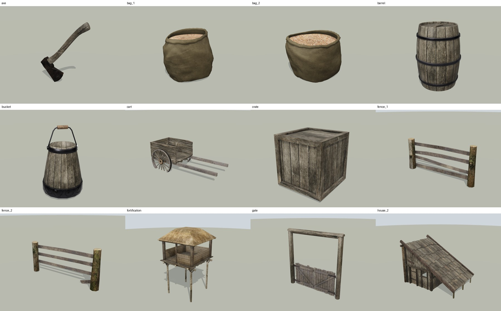
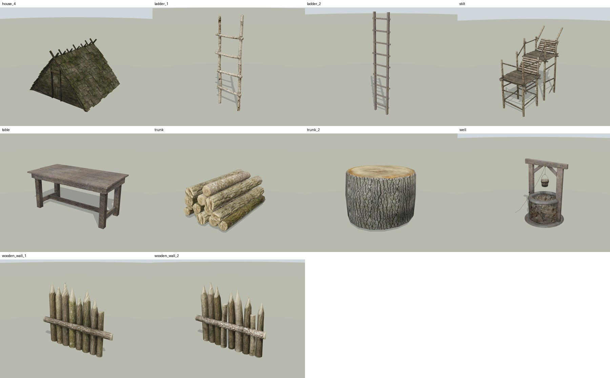
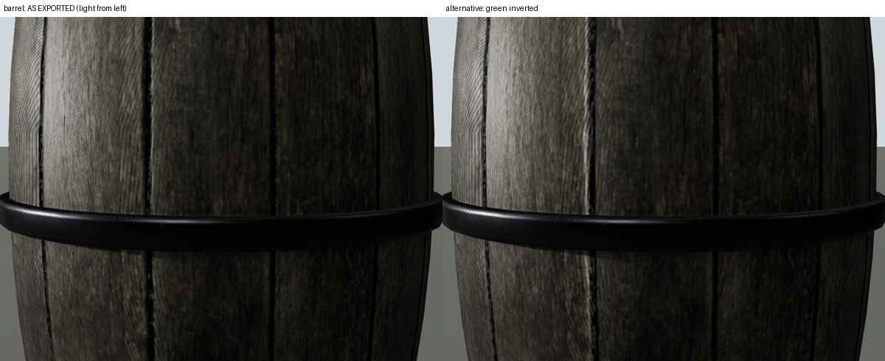

# Village House Kit → GLB por modelo

Separación de `village house kit.fbx` (todo el kit en un solo archivo) en **un GLB por modelo**, con sus texturas PBR incrustadas a la resolución original.

- Fuente: carpeta de Drive con el FBX, el MTL y 21 carpetas de texturas (kit de ArtStation, uso privado).
- Estado: **22 de 26 modelos listos** en [`glb/`](glb). Faltan 4 (`house_1`, `house_3`, `house_5`, `structure`) porque 7 de sus texturas no se pudieron descargar (ver [Pendientes](#pendientes)).




## Modelos entregados

Medidas en metros: ancho (X) × alto (Y) × fondo (Z).

| Archivo | Contenido | Medidas (m) | Triángulos | Texturas | Peso |
|---|---|---|---|---|---|
| `house_2.glb` | Casa 2 (cobertizo de tablas) + puerta | 6.91 × 5.00 × 5.12 | 2,996 | 4K | 18.4 MB |
| `house_4.glb` | Casa 4 (choza en A con tejas) + puerta | 5.45 × 3.63 × 5.26 | 4,804 | 4K | 37.9 MB |
| `gate.glb` | Portón de entrada + 2 hojas | 3.61 × 3.60 × 0.27 | 1,140 | 4K | 16.7 MB |
| `wooden_wall_1.glb` | Empalizada de troncos 1 | 3.14 × 2.60 × 0.44 | 1,348 | 4K | 16.7 MB |
| `wooden_wall_2.glb` | Empalizada de troncos 2 | 3.14 × 2.51 × 0.44 | 1,524 | 4K | 16.7 MB |
| `fortification.glb` | Torre de vigía con techo de paja | 4.62 × 7.64 × 4.75 | 2,016 | 4K | 19.8 MB |
| `stilt.glb` | Plataforma elevada sobre pilotes | 2.29 × 5.29 × 5.45 | 5,008 | 4K | 21.3 MB |
| `well.glb` | Pozo con cubeta y polea | 2.71 × 2.75 × 2.72 | 5,282 | 2K | 3.5 MB |
| `cart.glb` | Carreta de mano | 3.34 × 1.31 × 1.67 | 4,792 | 2K | 4.6 MB |
| `barrel.glb` | Barril | 0.70 × 0.95 × 0.70 | 3,442 | 1K | 2.4 MB |
| `crate.glb` | Caja de madera | 0.51 × 0.51 × 0.51 | 224 | 1K | 3.5 MB |
| `bag_1.glb` | Saco de grano 1 | 0.54 × 0.50 × 0.57 | 5,536 | 1K | 2.2 MB |
| `bag_2.glb` | Saco de grano 2 (forma distinta) | 0.49 × 0.40 × 0.50 | 5,536 | 1K | 2.2 MB |
| `bucket.glb` | Cubeta con asa | 0.40 × 0.63 × 0.40 | 1,120 | 1K | 2.4 MB |
| `table.glb` | Mesa | 1.94 × 0.89 × 1.01 | 244 | 2K | 13.1 MB |
| `trunk.glb` | Pila de troncos | 0.83 × 0.58 × 1.38 | 2,464 | 2K | 11.4 MB |
| `trunk_2.glb` | Tocón | 0.69 × 0.50 × 0.72 | 320 | 1K | 0.8 MB |
| `axe.glb` | Hacha | 0.49 × 0.60 × 0.05 | 848 | 1K | 1.0 MB |
| `ladder_1.glb` | Escalera rústica corta | 0.88 × 2.64 × 0.21 | 1,280 | 1K | 1.6 MB |
| `ladder_2.glb` | Escalera larga | 0.88 × 4.36 × 0.09 | 132 | 1K | 1.5 MB |
| `fence_1.glb` | Cerca 1 | 3.94 × 1.87 × 0.41 | 360 | 2K | 5.6 MB |
| `fence_2.glb` | Cerca 2 | 3.91 × 1.89 × 0.41 | 338 | 2K | 5.6 MB |

Los 34 objetos del FBX quedan en 26 modelos: las puertas no son modelos sueltos, van dentro de su casa o portón.

## Convenciones

- **glTF 2.0 binario** (`.glb`), un archivo autocontenido por modelo. Eje **Y hacia arriba**, unidades en **metros** (escala real del kit).
- **Pivote:** centrado en X/Z y apoyado en el suelo del kit (Y = 0). Las bases de las casas que el autor hundió unos centímetros en el terreno se respetan. El hacha, que en el kit descansa sobre el tocón, se bajó al suelo.
- **Puertas animables:** cada puerta es un nodo hijo (`house_2_door`, `gate_door_left`, `gate_door_right`, …) con su pivote en la bisagra. Basta con rotarla sobre su eje Y local para abrirla.
- **Materiales PBR metal/rugosidad:** color base, normal map (con tangentes MikkTSpace exportadas, igual que en el horneado), rugosidad y, donde el kit lo trae, metal. Todos son de doble cara. Los techos de paja usan `alphaMode: MASK`.

## Calidad de las texturas

- **Resolución original, sin reescalar:** 4K en casas y estructuras, 2K o 1K en props.
- **Sin recompresión:** el color base y los normal maps están incrustados **byte a byte idénticos** a los archivos originales (comprobado por hash SHA-256).
- Rugosidad y metal se empaquetaron en un PNG sin pérdida (canal G = rugosidad, B = metal). Comparados píxel a píxel con los originales, la diferencia es **0**.
- **Corrección de normal maps:** 5 juegos venían en convención DirectX: `bag`, `barrel`, `bucket`, `ladders` y `table`. glTF exige OpenGL, así que se les invirtió el canal verde. Sin esa corrección, juntas y clavos se ven en relieve en vez de hundidos. Se determinó por mapa con tres pruebas independientes: integrabilidad del campo de normales, perfil del verde en juntas conocidas y render con luz rasante. El resto ya era OpenGL y no se tocó. 
- Los mapas metálicos de `trunk 2` y `fence` están completamente en negro (no son metal), así que no se usan. El resultado es idéntico.

## Verificación realizada

| Prueba | Resultado |
|---|---|
| Validador oficial Khronos glTF-Validator | 22/22 con 0 errores y 0 advertencias |
| Geometría frente al FBX | Triángulos idénticos en los 22 modelos |
| Texturas incrustadas frente a las originales | Color y normales idénticos byte a byte; rugosidad y metal con diferencia 0 píxel a píxel |
| Render en visor web (three.js, Chromium) | Los 22 modelos cargan con todas sus texturas, desde dos ángulos (`previews/`) |
| Normal maps | Juntas y grietas hundidas con luz rasante (barril, cubeta, caja) |

## Pendientes

Faltan 4 modelos porque Google Drive no permitió descargar 7 texturas desde este entorno. El conector de Drive tiene un límite de ~6–10 MB por archivo y la descarga directa de Drive está bloqueada por la política de red del entorno.

| Modelo | Texturas que faltan |
|---|---|
| `house_1` | `house 1/roof 1_BaseColor.png` (21.9 MB), `house 1/roof 1_Normal.png` (19.8 MB) |
| `house_3` | `house 3/roof 3_BaseColor.png` (29.0 MB), `house 3/roof 3_Normal.png` (17.0 MB) |
| `house_5` | `house 5/roof 5_BaseColor.png` (19.4 MB), `house 5/roof 5_Normal.jpg` (12.6 MB) |
| `structure` | `structure/structure_Normal.jpg` (6.5 MB) |

El resto de texturas de esos modelos ya está descargado y el pipeline ya los contempla. Para completarlos basta **una** de estas opciones:

1. **Permitir Drive en la red del entorno** (lo más simple). En Claude Code, menú del entorno → *Edit* → *Network access* → *Custom*: añadir `drive.google.com` y `drive.usercontent.google.com` (manteniendo los dominios por defecto). Pasos: https://code.claude.com/docs/en/cloud-environments#network-access. Los archivos ya están compartidos como "cualquiera con el enlace".
2. **Subir los 7 archivos a este repositorio** con `git push` (por ejemplo a `village-house-kit/texturas_pendientes/`). La web de GitHub no sirve para `roof 3_BaseColor.png`, que pasa de su límite de 25 MB.
3. **Partir cada archivo en trozos de 5 MB** (7-Zip → "Dividir en volúmenes: 5M") y subirlos a la misma carpeta de Drive.

Después se regenera todo con dos comandos (ver abajo).

## Posición original en la aldea

Para reconstruir la escena del kit, coloca cada GLB en estas coordenadas glTF (metros, Y arriba), sin rotación:

| Modelo | X | Y | Z |
|---|---|---|---|
| `house_1` *(pendiente)* | 0.843 | 0.000 | 0.001 |
| `house_2` | 11.154 | 0.000 | -0.097 |
| `house_3` *(pendiente)* | -11.020 | 0.000 | 0.545 |
| `house_4` | 17.782 | 0.000 | -0.013 |
| `house_5` *(pendiente)* | 26.925 | 0.000 | 0.168 |
| `gate` | -0.023 | 0.000 | 5.881 |
| `wooden_wall_1` | 3.802 | 0.000 | 5.933 |
| `wooden_wall_2` | 7.327 | 0.000 | 5.931 |
| `fortification` | -19.869 | 0.000 | 0.000 |
| `stilt` | -20.789 | 0.000 | 5.899 |
| `structure` *(pendiente)* | 37.781 | 0.000 | 0.922 |
| `well` | 10.975 | 0.000 | 6.272 |
| `cart` | -3.903 | 0.000 | 9.707 |
| `barrel` | -1.381 | 0.000 | 9.653 |
| `crate` | 0.000 | 0.000 | 9.404 |
| `bag_1` | 7.012 | 0.000 | 9.591 |
| `bag_2` | 6.408 | 0.000 | 9.590 |
| `bucket` | 7.781 | 0.000 | 9.471 |
| `table` | 2.564 | 0.000 | 9.407 |
| `trunk` | -3.476 | 0.000 | 5.769 |
| `trunk_2` | 5.730 | 0.000 | 9.531 |
| `axe` | 5.833 | 0.465 | 9.553 |
| `ladder_1` | 0.872 | 0.000 | 9.788 |
| `ladder_2` | 4.459 | 0.000 | 9.546 |
| `fence_1` | 15.867 | 0.000 | 9.280 |
| `fence_2` | 10.846 | 0.000 | 9.278 |

## Regenerar

Requisitos: Python 3.11 con `bpy==5.0.1` (Blender como módulo), `numpy` y `pillow`. Las rutas de trabajo se configuran en `scripts/kit_config.py` (variable `KIT_WORK`).

```bash
python scripts/prepare_textures.py   # texturas listas para glTF (originales intactos, empaquetados sin pérdida)
python scripts/build_glb.py          # un GLB por modelo en glb/ + build_report.json
python scripts/inspect_glb.py        # auditoría: texturas, materiales, nodos, medidas
```

`build_glb.py` omite cualquier modelo con texturas incompletas, salvo que se pase `--allow-incomplete`. Con `--only house_1,house_3` reconstruye sólo esos.
